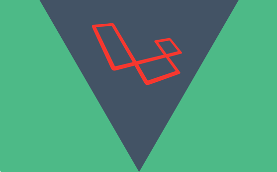

# Laravel環境で取り入れている、テストを楽にするTips

--- 

## 自己紹介


- 株式会社SCOUTER CTO
- @kotamat
- 🚲

---

## SCOUTERとは


---

## LaraVue勉強会



- LaravelとVue.jsの勉強会
- 次回は4月くらいに開催予定

---
## みなさんテストやってますか？

🙋

---  


---

## 今日話すこと

- Laravelでテストを書くときに便利になりそうなTips
    - APIspecテスト
    - ModelFactory
    - Table Driven Test

--- 

## APIspecテスト

- Laravelに標準で搭載されているHTTPリクエストを仮想的に使える関数を使ったテスト
- APIのE2Eの振る舞いをテストするのに簡単に使える
- LaravelではHTTPテストになっている
    - https://laravel.com/docs/5.6/http-tests

---

### 呼び出し方

---?code=routes/api.php&lang=php

@[17-33](例えばこんなAPIがあったとき)

---?code=tests/Feature/ApiTest.php&lang=php&title=tests/Feature/ApiTest.php

@[14-16](GETパラメータを定義しておき)
@[18-19](routeの第二引数にパラメータを渡してレスポンス取得)
@[21](ステータス200かどうかチェック)
@[22](取得したデータをprint_rで表示)

--- 

### 実行結果

```
Array
(
    [page] => 1
)
```


---?code=tests/Feature/ApiTest.php&lang=php&title=tests/Feature/ApiTest.php

@[30-32](POSTも同様に配列でパラメータを定義)
@[34-35](今度はpostJsonの第二引数にパラメータを渡す(getパラメータではないので))
@[37](ステータス200かどうかチェック)
@[38](取得したデータをprint_rで表示)

--- 

### 実行結果

```
Array
(
    [name] => hoge
)
```

---?code=tests/Feature/ApiTest.php&lang=php&title=tests/Feature/ApiTest.php

@[44](PUTの場合は)
@[46-51](送信データとGETパラメータを双方定義し)
@[54](routeの第二引数と、putJsonの第二引数それぞれに渡してあげて)
@[37](ステータス200かどうかチェック)
@[38](取得したデータをprint_rで表示)

--- 

### 実行結果

```
Array
(
    [id] => 1
    [name] => hoge
)
```

---?code=tests/Feature/ApiTest.php&lang=php&title=tests/Feature/ApiTest.php

@[63-74](deleteも同様)

--- 

### 実行結果

```
Array
(
    [id] => 1
)
```

--- 

### 応用

- これを用いることで、API定義書を自動生成することが可能となる。
- 色々なプロジェクトで使用できるようにAPI定義書自動生成ツールを作成した。
- [kotamat/laravel-apispec-generator](https://github.com/kotamat/laravel-apispec-generator)

--- 

#### 使い方

---

#### インストール

```bash
composer require --dev kotamat/laravel-apispec-generator
```

---?code=composer.json&lang=php&title=composer.json

@[17](composer requireでkotamat/laravel-apispec-generatorをインストール)

---

#### TestCaseを拡張

---?code=tests/ApiSpecTestCase.php&lang=php&title=ApiSpecTestCase.php

@[5-7](ベースとなるTestCaseクラスにて、ApiSpecTestCaseをextendするように修正)

---

#### テストを書く

---?code=tests/Feature/ApiWithSpecTest.php&lang=php&title=tests/Feature/ApiWithSpecTest.php

@[9](実際のクラスでは$isExportSpec=trueにしたあと)
@[13-23](先程と同様にテストを記述)
@[28-38](先程と同様にテストを記述)
@[43-56](先程と同様にテストを記述)
@[61-71](先程と同様にテストを記述)

---

#### storage/appディレクトリに出力

---?code=storage/app/api/testpage1/GET.http&lang=http&title=get

@[1](実際のリクエスト)
@[2-3](各種ヘッダー)
@[5-8](返り値JSON)

---?code=storage/app/api/test/POST.http&lang=http&title=post

@[1](実際のリクエスト)
@[2-3](各種ヘッダー)
@[5-7](ボディ)
@[8-11](返り値JSON)

---?code=storage/app/api/test/1/PUT.http&lang=http&title=put

@[1](実際のリクエスト)
@[2-3](各種ヘッダー)
@[5-7](ボディ)
@[8-12](返り値JSON)

---?code=storage/app/api/test/1/DELETE.http&lang=http&title=delete

@[1](実際のリクエスト)
@[2-3](各種ヘッダー)
@[5-8](返り値JSON)

---

### デモ

---

### まとめ

- APIスペック用のテストケースを書くだけで、API仕様書を記述可能
- .http形式を読み込めるエディターで動作確認可能

---

## ModelFactory

- 任意のEloquentモデルのテストデータを生成できる
- Eloquentモデル使ってると幸せになれる機能
- フォーム関連の入力値生成とか雑にデータを生成したいときに使う
- デフォで入ってる

---?code=database/factories/UserFactory.php&lang=php&title=database/factories/UserFactory.php

@[16]($factory->defineで対象モデルを指定し)
@[19-24](返却したいデータを定義)

---?code=tests/Feature/ModelFactoryTest.php&lang=php&title=tests/Feature/ModelFactoryTest.php

@[15](factory(User::class)->make()で生成)
@[16-21](必要な情報がちゃんと入ってくる)

--- 

### APIと絡める

---?code=tests/Feature/ModelFactoryTest.php&lang=php&title=tests/Feature/ModelFactoryTest.php

@[29](インスタンス生成)
@[30](配列化)
@[32](userをstore)

---

### APIと絡めることで

- 送信用データをいちいち作成する手間が無くなる。
- factoryの値をfakerで定義しておけば色々なダミーデータでチェックできる

---

### 応用

#### 複数のリポジトリでModelを共有してるときどうする 🤔

---

```
- app/User.php // SubClass
- database/factories/UserFactory.php
- tests/Feature/ModelFactoryTest.php
- vendor/abstract/repository/src/User.php // SuperClass
```

- どこかのリポジトリでModelを抽象化
- その他複数のリポジトリでそのModelを継承して使用
- factoryした結果は継承先のモデルのインスタンスとして使用したい

---?code=app/User.php&lang=php&title=SuperClass
---?code=database/factories/UserFactory.php&lang=php&title=database/factories/UserFactory.php
---?code=app/UserB.php&lang=php&title=SubClass
---?code=tests/Feature/ModelFactoryTest.php&lang=php&title=TestCase

@[41](こうしたら)
@[42](これを通したい)

---

#### 呼び出しもとのリポジトリで配列を生成

---?code=app/Utility/ModelFactoryParams.php&lang=php

@[9](static関数を定義)
@[11](fakerで)
@[14-21](対象のモデルに対するデータを返すモデルを定義)


---?code=database/factories/OtherRepoFactory.php&lang=php

@[3](定義ファイルをforeachで回す)
@[4,6](使用側でのリポジトリで所定のnamespaceで定義)
@[5](単純に$paramを返す)

---

### まとめ

- Model定義層で配列生成→使用側で一気にfactory登録で関心の分離
- ApiSpecの自動生成と併用すると👍

---

# Table Driven Test

- Golang界隈で人気のテスト手法
- 入力パラメータの色々な組み合わせと正しい出力パラメータを繰り返し分でぶん回してチェックする

---

## Golangの場合

---?code=tests/tdt.go&lang=go

@[3-5](a*bを定義)

---?code=tests/tdt_test.go&lang=go

@[6-8](入力値型を定義)
@[10-14](テストの型を定義しつつ)
@[15-17](入力値と出力値の組み合わせを定義し)
@[19-24](forでぶん回す)

---

## 応用

テーブル型でチェックするため全ペアテストへの応用が効きやすい

---

### 全ペアテスト🤔

- 全ての入力値パターンを全ての組み合わせでチェックしようとすると膨大な数のテストケースが必要
    - 3つの引数がそれぞれ100通りの値を取りうる場合、100×100×100=1000000通り必要
- 無作為に値を抽出すると考慮漏れが発生する可能性があるが、全ペアテストを導入することで全体の1〜20%のチェック項目で70〜85%のチェックができる
- 全ペアの生成は色々なツールが出てる

---

### pictを使って全ペアを算出

- [pict](https://github.com/Microsoft/pict)をインストール
-
```bash
alias genAllPair="pict <(pbpaste) /d:\"|\" /a:~ | tr '\t' ', ' | pbcopy"
```
みたいなかんじでエイリアス張っておく
- テストケースをPHPDocに書いておく
- テストケースをコピってターミナルで`genAllPair`と打つ
- 出力された値をソースコードにコピってテストを書く

---

# 🤔

---

### よくわからないのでデモ😅

---

### まとめ

- テストはなるべく手を抜いて効果を最大化しよう
- 色々な手法を知ってると便利💪
- 他に便利な手法しってたら教えて下さい！🙏
- ~~Golangはいいぞ~~
